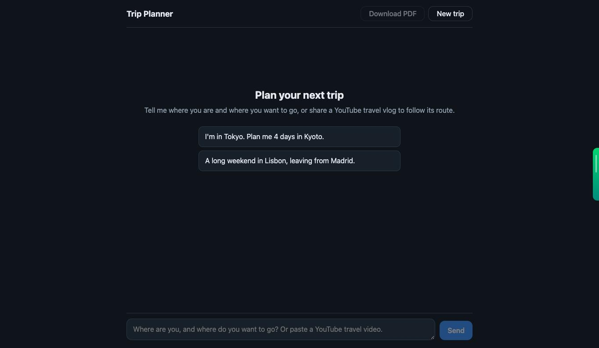
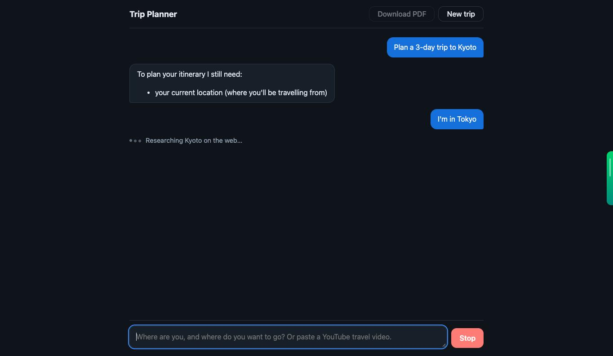
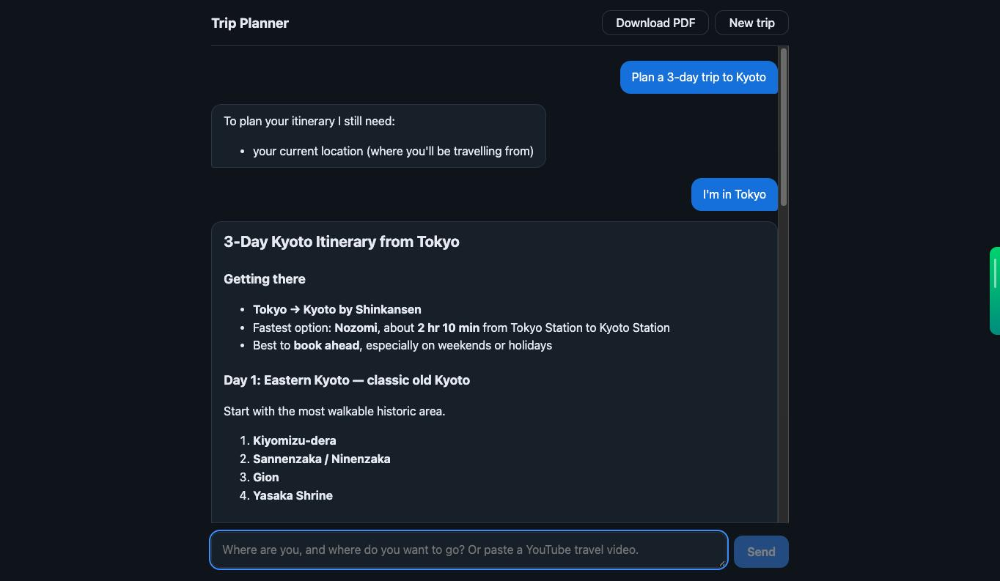
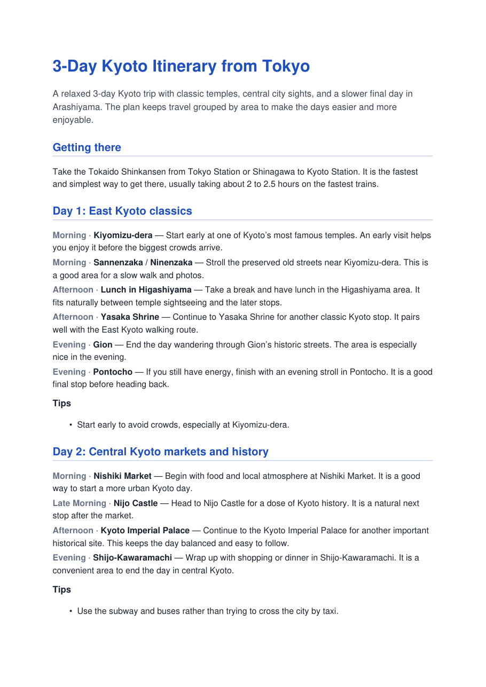

# Itinerary planner

A ReAct-style LangGraph agent that plans trips, with a FastAPI streaming backend and a React chat UI.

- Share a **YouTube travel video** → it mines the transcript for the route taken.
- Otherwise it **researches the destination** with OpenAI web search.
- It asks for your current location / destination if they're missing, and remembers the conversation per thread.

## Screenshots

**Start a trip** — pick an example or describe your own.



**It asks for what's missing, then shows what it's doing** while it researches.



**The itinerary streams in** as formatted Markdown; **Download PDF** becomes available.



**Download PDF** — the LLM polishes the plan into a structured, day-by-day document.



## Setup

```bash
cp .env.example .env          # add OPENAI_API_KEY; the other settings are optional
uv sync
cd frontend && npm install
```

## Run

```bash
uv run itinerary-planner      # API on http://127.0.0.1:$PORT (default 8001)
cd frontend && npm run dev    # UI on http://localhost:5173, proxies /api to the same HOST/PORT
```

Both read `HOST` and `PORT` from the project-root `.env`, so changing them there moves the API
and the UI's proxy together (restart both after a change). Set `RELOAD=1` to auto-reload the API
on code changes.

## Test

```bash
uv run pytest                 # backend: unit + integration (OpenAI and YouTube are faked)
cd frontend && npm test       # frontend: Vitest
```

CI runs both on every push and pull request (`.github/workflows/ci.yaml`).

## API

`POST /api/chat` with `{"thread_id": "...", "message": "..."}` returns `text/event-stream`:

| event    | data                  | meaning                                   |
|----------|-----------------------|-------------------------------------------|
| `token`  | `{"text": "..."}`     | next piece of the assistant's reply        |
| `status` | `{"message": "..."}`  | progress, e.g. "Researching Kyoto on the web…" |
| `error`  | `{"message": "..."}`  | the run failed (user-safe message)         |
| `done`   | `{}`                  | always sent last                           |

Conversation state lives in memory (`InMemorySaver`), so threads are lost when the server restarts.

## Layout

```
src/itinerary_planner/
  config.py     settings from env / .env
  schemas.py    graph state + structured-output models
  youtube.py    URL parsing, transcript fetching
  tools.py      the two agent tools + tool-error handling
  graph.py      nodes, routing, build_graph()
  streaming.py  graph run -> chat events (SSE)
  api.py        FastAPI app
frontend/src/
  api/streamChat.ts   fetch + SSE parser
  hooks/useChat.ts    conversation state, streaming, stop, new trip
  components/         MessageList, MessageBubble, StatusIndicator, Composer, EmptyState
notebooks/testing.ipynb  scratchpad for experimenting with the graph
tests/                   offline tests (uv run pytest)
```
